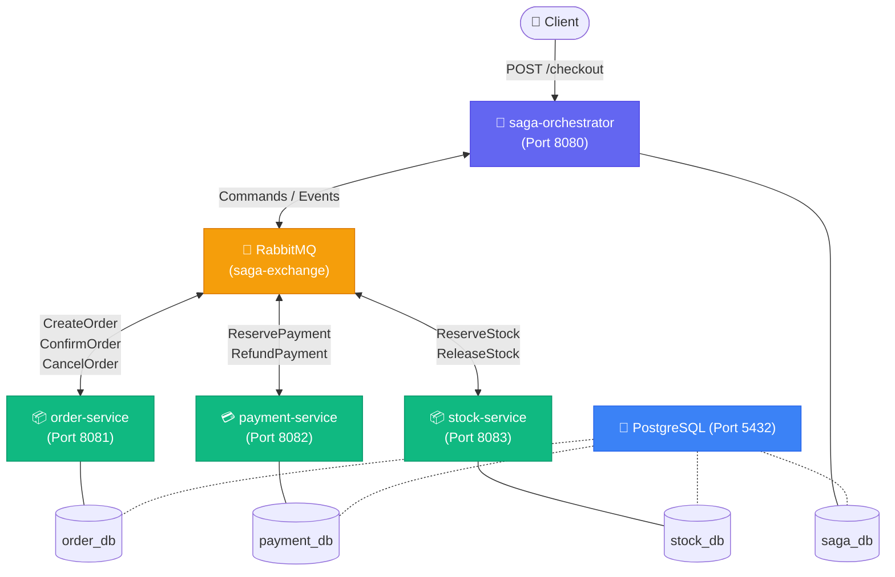
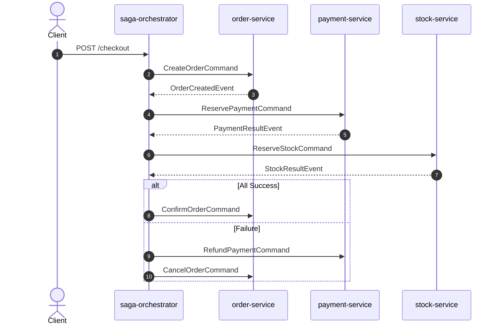
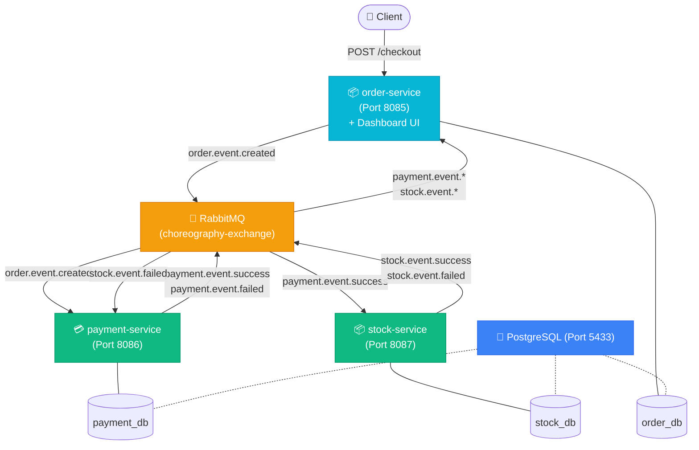
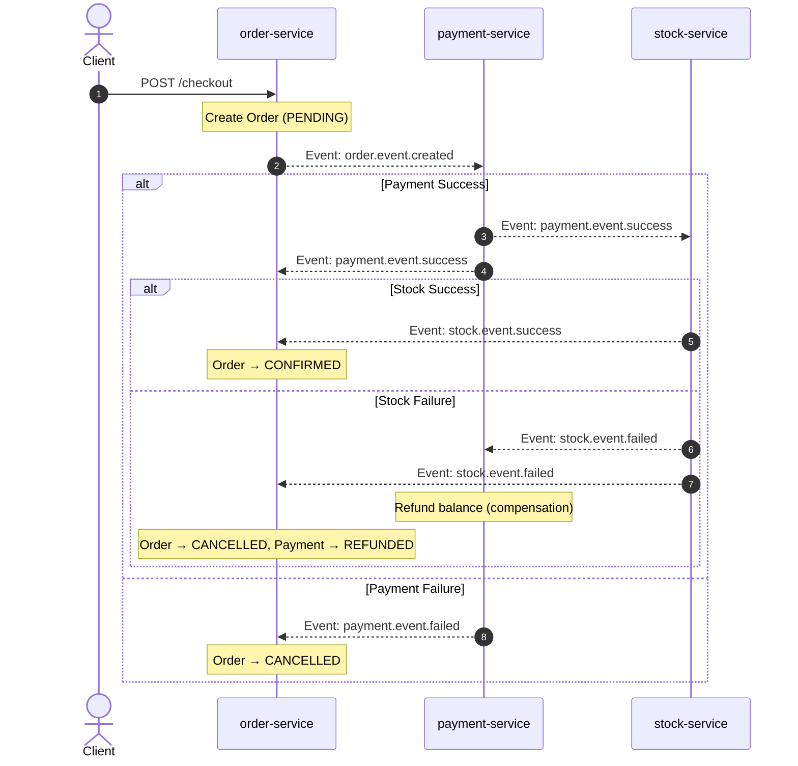

# 🌌 Distributed SAGA Patterns — Orchestration & Choreography

A comprehensive, educational monorepo implementing **two** core SAGA patterns for managing distributed transactions in a microservices architecture: **Orchestration** (centralized coordinator) and **Choreography** (decentralized event-driven). Built with Java 21, Spring Boot 3, RabbitMQ, and PostgreSQL.

Each pattern includes a **visual real-time dashboard** to explore transaction flows, inspect database states, and test failure/compensation scenarios with a single click.

---

## 📁 Monorepo Structure

```
saga-microservices/
│
├── orchestration/              # Centralized SAGA Orchestrator pattern
│   ├── saga-orchestrator/      # Central coordinator + Web UI (Port 8080)
│   ├── order-service/          # Order management (Port 8081)
│   ├── payment-service/        # Payment processing (Port 8082)
│   ├── stock-service/          # Inventory management (Port 8083)
│   ├── docker-compose.yml
│   ├── init-db.sql
│   └── pom.xml
│
├── choreography/               # Decentralized event-driven Choreography pattern
│   ├── order-service/          # Order management + Web UI (Port 8085)
│   ├── payment-service/        # Payment processing (Port 8086)
│   ├── stock-service/          # Inventory management (Port 8087)
│   ├── docker-compose.yml
│   ├── init-db.sql
│   └── pom.xml
│
└── README.md
```

Both implementations can run **side by side** on the same machine — each uses its own Docker containers, Postgres instance, and RabbitMQ broker with non-overlapping ports.

---

## ⚖️ Orchestration vs Choreography

| Aspect | Orchestration | Choreography |
|---|---|---|
| **Coordinator** | Dedicated `saga-orchestrator` service | None — services react to events |
| **Communication** | Commands & Events via orchestrator | Direct event-to-event between services |
| **State Tracking** | Centralized in `saga_db` | Distributed — each service tracks its own state |
| **Compensation** | Orchestrator issues rollback commands | Services listen for failure events and self-compensate |
| **Coupling** | Services unaware of each other | Services must know which events to emit and react to |
| **Dashboard** | Served by `saga-orchestrator` on `:8080` | Served by `order-service` on `:8085` |

---

## 🏗️ Architecture: Orchestration Pattern

A **centralized saga-orchestrator** drives the transaction by issuing commands and listening for result events.



### Transaction Flow (Sequence)



### Services
| Service | Port | Database | Role |
|---|---|---|---|
| `saga-orchestrator` | `8080` | `saga_db` | Central coordinator, state machine, dashboard UI |
| `order-service` | `8081` | `order_db` | Creates / confirms / cancels orders |
| `payment-service` | `8082` | `payment_db` | Reserves / refunds customer balances |
| `stock-service` | `8083` | `stock_db` | Reserves / releases product inventory |
| RabbitMQ | `5672` / `15672` | — | Message broker (`saga-exchange`) |
| PostgreSQL | `5432` | 4 databases | Persistent storage |

---

## 🏗️ Architecture: Choreography Pattern

Services communicate **directly** via events on a shared topic exchange — no central coordinator.



### Transaction Flow (Sequence)



### Services
| Service | Host Port | Container Port | Database | Role |
|---|---|---|---|---|
| `order-service` | `8085` | `8081` | `order_db` | Initiates saga, tracks order + step states, dashboard UI |
| `payment-service` | `8086` | `8082` | `payment_db` | Reacts to order events, reserves/refunds funds |
| `stock-service` | `8087` | `8083` | `stock_db` | Reacts to payment events, reserves inventory |
| RabbitMQ | `5673` / `15673` | `5672` / `15672` | — | Message broker (`choreography-exchange`) |
| PostgreSQL | `5433` | `5432` | 3 databases | Persistent storage |

### Key Design Decision: Decentralized State Tracking

In choreography, there is no central `saga_db`. Instead, the `order-service` stores enriched fields directly on its `OrderEntity`:

- `paymentStatus` — `PENDING` → `SUCCESS` / `FAILED` / `REFUNDED`
- `stockStatus` — `PENDING` → `SUCCESS` / `FAILED`
- `errorMessage` — reason for failure (e.g., `"Insufficient funds"`, `"Out of stock"`)

This allows the dashboard to reconstruct the full SAGA pipeline visualization without querying a centralized state store.

---

## 🌌 Visual SAGA Dashboards

Both implementations come with beautiful, interactive **real-time dashboards**:

| Feature | Orchestration (`:8080`) | Choreography (`:8085`) |
|---|---|---|
| Interactive checkout form | ✅ | ✅ |
| One-click test scenarios | ✅ Happy Path, Payment Fail, Stock Fail | ✅ Happy Path, Payment Fail, Stock Fail |
| Database state tables | ✅ Balances, Inventory, Orders | ✅ Balances, Inventory, Orders |
| Pipeline step visualizer | ✅ 4 steps (Order → Payment → Stock → Result) | ✅ 3 steps (Order → Payment → Stock) |
| Auto-refresh (2s) | ✅ | ✅ |
| Database reset button | ✅ | ✅ |

---

## ⚡ Setup & Launch

### Prerequisites
- Java 21+ & Maven 3.8+
- Docker & Docker Compose

### Run Orchestration

```bash
# Build
mvn clean package -DskipTests -f orchestration/pom.xml

# Start containers
docker compose -f orchestration/docker-compose.yml up --build -d
```

Open **[http://localhost:8080/](http://localhost:8080/)** for the Orchestration dashboard.

### Run Choreography

```bash
# Build
mvn clean package -DskipTests -f choreography/pom.xml

# Start containers
docker compose -f choreography/docker-compose.yml up --build -d
```

Open **[http://localhost:8085/](http://localhost:8085/)** for the Choreography dashboard.

> **Tip**: Both can run simultaneously — they use separate Docker networks and non-overlapping ports.

### Stop Services

```bash
docker compose -f orchestration/docker-compose.yml down
docker compose -f choreography/docker-compose.yml down
```

---

## 🧪 Testing Scenarios

All three core scenarios are available in both dashboards as one-click templates, or via `curl`:

### 1. ✅ Happy Path (Success)
Alex ($150 balance) buys 1 `JavaBook` ($100, stock: 5). All steps succeed.
```bash
# Orchestration
curl -X POST -H "Content-Type: application/json" \
  -d '{"userId":"Alex","itemId":"JavaBook","quantity":1,"price":100.0}' \
  http://localhost:8080/checkout

# Choreography
curl -X POST -H "Content-Type: application/json" \
  -d '{"userId":"Alex","itemId":"JavaBook","quantity":1,"price":100.0}' \
  http://localhost:8085/checkout
```
**Result**: Order `CONFIRMED`. Balance: $150 → $50. Stock: 5 → 4.

### 2. 💳 Payment Failure (Insufficient Funds)
PoorBob ($15 balance) tries to buy `JavaBook` ($100).
```bash
# Orchestration
curl -X POST -H "Content-Type: application/json" \
  -d '{"userId":"PoorBob","itemId":"JavaBook","quantity":1,"price":100.0}' \
  http://localhost:8080/checkout

# Choreography
curl -X POST -H "Content-Type: application/json" \
  -d '{"userId":"PoorBob","itemId":"JavaBook","quantity":1,"price":100.0}' \
  http://localhost:8085/checkout
```
**Result**: Order `CANCELLED`. Error: `"Insufficient funds"`. Balance unchanged.

### 3. 📦 Stock Failure (Compensation Rollback)
Alex tries to buy `RareVinyl` ($50, stock: 0).
```bash
# Orchestration
curl -X POST -H "Content-Type: application/json" \
  -d '{"userId":"Alex","itemId":"RareVinyl","quantity":1,"price":50.0}' \
  http://localhost:8080/checkout

# Choreography
curl -X POST -H "Content-Type: application/json" \
  -d '{"userId":"Alex","itemId":"RareVinyl","quantity":1,"price":50.0}' \
  http://localhost:8085/checkout
```
**Result**: Payment reserved → Stock fails → Payment **refunded** (compensation) → Order `CANCELLED`.

### Reset Database State
```bash
# Orchestration
curl -X POST http://localhost:8080/checkout/reset

# Choreography
curl -X POST http://localhost:8085/checkout/reset
```

---

## 🛡️ Production Robustness: Poison Pill Protection

In standard Spring AMQP listeners, an unhandled exception (deserialization mismatch, null pointer, DB timeout) will automatically requeue the message. If the failure is persistent, RabbitMQ retargets the consumer in a tight loop, causing **100% CPU usage** and infinite log spam.

All microservices in both patterns are protected with:
```properties
spring.rabbitmq.listener.simple.default-requeue-rejected=false
```
This guarantees that poison messages are rejected immediately without requeuing, maintaining near-zero CPU footprint during error conditions.

---

## 🛠️ Tech Stack

| Technology | Version | Purpose |
|---|---|---|
| Java | 21 | Runtime |
| Spring Boot | 3.4.0 | Application framework |
| Spring AMQP | — | RabbitMQ integration |
| Spring Data JPA | — | PostgreSQL ORM |
| RabbitMQ | 3-management | Async message broker |
| PostgreSQL | 15-alpine | Persistent storage |
| Docker Compose | — | Container orchestration |
| Jackson | — | JSON serialization for AMQP messages |

---

## 📖 Learning Resources

This project demonstrates key distributed systems concepts:

- **SAGA Pattern** — managing distributed transactions without 2PC
- **Orchestration vs Choreography** — two fundamental coordination strategies
- **Compensating Transactions** — rolling back completed steps on failure
- **Event-Driven Architecture** — loose coupling via asynchronous messaging
- **Database-per-Service** — data isolation in microservices
- **Idempotent Operations** — safe message reprocessing
- **Poison Pill Protection** — preventing infinite retry loops
