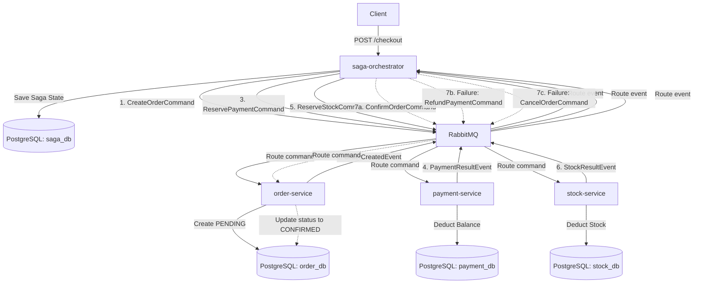

# 🌌 Distributed SAGA Pattern with Dedicated Orchestrator

An educational, production-like implementation of the **Orchestrator-based SAGA Pattern** across multiple microservices in Java 21, Spring Boot, RabbitMQ, and PostgreSQL. It features a complete visual control center dashboard for testing and tracking distributed transaction pipelines.

---

## 🏗️ Architecture & Component Overview

The system consists of **4 Spring Boot microservices**, **RabbitMQ** as the message broker, and a single **PostgreSQL** instance configured with 4 separate logical databases to enforce database-per-service isolation.



### 📦 Microservices Layout
1. **`saga-orchestrator`** (Port `8080`): Exposes the `/checkout` entry API, drives the SAGA state machine, tracks status in `saga_db`, and hosts the static dashboard Web UI.
2. **`order-service`** (Port `8081`): Creates orders in `order_db` and manages order states (`PENDING`, `CONFIRMED`, `CANCELLED`).
3. **`payment-service`** (Port `8082`): Manages customer balances and processes transactions in `payment_db` (`SUCCESS`, `REFUNDED`, `FAILED`).
4. **`stock-service`** (Port `8083`): Manages product inventory and reserves/releases stock levels in `stock_db` (`RESERVED`, `RELEASED`, `FAILED`).
5. **`rabbitmq-broker`** (AMQP Port `5672`, Management UI `15672`): Routes commands and events asynchronously using a topic exchange (`saga-exchange`).

---

## 🌌 Visual SAGA Dashboard & Control Center

You can monitor and interact with the entire workflow via a beautiful, built-in **SAGA Dashboard** served directly by the orchestrator at:

👉 **[http://localhost:8080/](http://localhost:8080/)**

### Dashboard Features:
* **Interactive Checkout Form**: Execute custom transactions by entering your own parameters.
* **One-Click Scenario Templates**: Instantly populate and run Happy Path, Payment Failure, and Stock Failure tests.
* **Database State Dashboard**: View real-time SQL data query results for payment balances, stock inventory levels, and order listings.
* **Step-by-Step Pipeline Tracker**: Select any transaction to view a visual flowchart of the SAGA sequence, showing which microservice succeeded, failed, or was compensated.
* **Auto-Refresh Console**: Polls data updates every 2 seconds automatically.
* **Database Reset Console**: A button to wipe transaction history and re-seed databases to default states (Alex = \$150.00, PoorBob = \$15.00, JavaBook = 5 units, RareVinyl = 0 units).

---

## ⚡ Setup & Launch Instructions

### Prerequisites
* Java 21+ & Maven 3.8+
* Docker & Docker Compose

### 1. Build Jar Packages
Compile and repackage all microservices:
```bash
mvn clean package -DskipTests
```

### 2. Boot Up the Containers
Run Docker Compose in the project root folder to spin up Postgres, RabbitMQ, and the 4 microservices:
```bash
docker compose up --build -d
```
*(All services will boot once RabbitMQ and Postgres report as healthy).*

---

## 🧪 Testing Scenarios

You can test the distributed SAGA behaviors using the Dashboard UI templates or executing the following `curl` calls directly:

### 1. Happy Path (Success)
Alex (starts with \$150) buys 1 `JavaBook` (\$100). All steps succeed.
```bash
curl -X POST -H "Content-Type: application/json" -d '{"userId":"Alex", "itemId":"JavaBook", "quantity":1, "price":100.0}' http://localhost:8080/checkout
```
* **Result**: Order is `CONFIRMED`. Alex's balance is `$50.0`. Stock is decremented to `4`.

### 2. Payment Failure (Insufficient Funds)
PoorBob (starts with \$15) attempts to buy a `JavaBook` (\$100).
```bash
curl -X POST -H "Content-Type: application/json" -d '{"userId":"PoorBob", "itemId":"JavaBook", "quantity":1, "price":100.0}' http://localhost:8080/checkout
```
* **Result**: Payment reservation fails. Orchestrator triggers compensation. Order `PENDING` is changed to `CANCELLED`. PoorBob's balance remains `$15.0`.

### 3. Stock Failure (Compensation Rollback)
Alex attempts to buy `RareVinyl` (\$50), which has 0 units in stock.
```bash
curl -X POST -H "Content-Type: application/json" -d '{"userId":"Alex", "itemId":"RareVinyl", "quantity":1, "price":50.0}' http://localhost:8080/checkout
```
* **Result**: Payment reservation succeeds (Alex balance goes $50 ➡️ $0), but Stock reservation fails. Orchestrator triggers rollback:
  1. Payment Service refunds `$50.0` to Alex (Balance goes back to `$50.0`).
  2. Order Service cancels the order (`CANCELLED`).

---

## 🛡️ Production Robustness: Poison Pill Protection

In standard Spring AMQP listeners, an unhandled exception (like a deserialization type mismatch, null pointer, or DB timeout) will automatically requeue the message. If the failure is persistent, RabbitMQ will retarget the consumer in a tight loop, causing **100% CPU usage** and infinite log warnings.

We secured the messaging framework in this repository by configuring:
```properties
spring.rabbitmq.listener.simple.default-requeue-rejected=false
```
in all microservices. This guarantees that any execution/conversion failures reject the poison message immediately without requeuing, maintaining near-zero CPU footprint during error cases.
